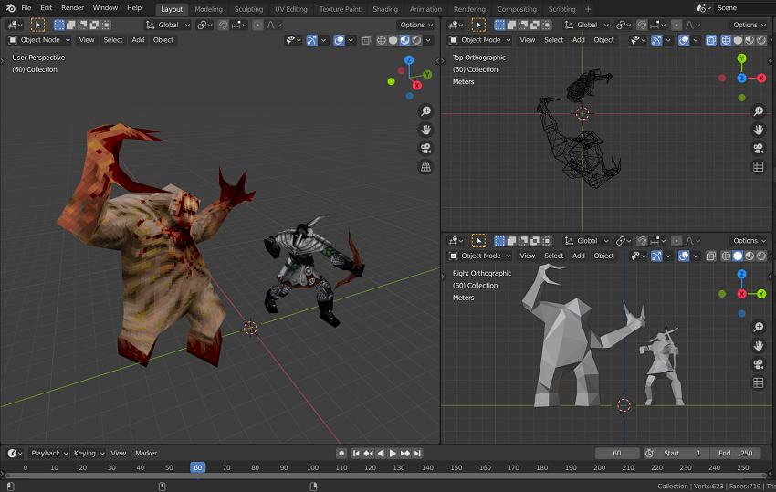

# Quake and Hexen II MDL Importer and Exporter for Blender 2.8+
Import and Export ID's Quake and Ravensoft's Hexen II MDL models to and from Blender 2.8+

# Download
[Latest version](https://mega.nz/file/jR8nUQrD#KYlqapdsryhplf_22y89cOHOAHWsctZ-TOkZCHNUE24)

# About

This model exporter/importer is a fork of [Blender MDL import/export](https://en.blender.org/index.php/Extensions:2.6/Py/Scripts/Import-Export/Quake_mdl) by QuakeForge.
This versions is updated to work with Blender 2.8 or greater and has some new features such as support for Hexen II palette.
Some queues were taken from [Khreator](https://twitter.com/khreathor) adaptation to MDL Exporter for Blender 2.8+. It can be found [here](https://bitbucket.org/khreathor/mdl-for-blender/wiki/Home).

# How to Contribute
## On Github
- Create issues with a description and a minimum of steps to reproduce if it's a bug
- Submit feature requests
- Contact me to contribute with pull requests
## Buy me coffee ☕️
[ko-fi page](https://ko-fi.com/victorfeitosa)

# Roadmap
## Latest new features added
- Import/Export scale adjusts for the model and the `eyeposition` tag
- Support for Hexen II palette on the Import/Export file menu
- Better support for skins
- Emissive material added automatically
- Support for Hexen II Portals of Praevus model format
- Added import and export support for Hexen II model flags

## TO DO
- Add the option to exclude brightmap colours from the texture conversion process, approximating textures colours to only the non-bright palette colours
- Add support for custom palettes
- Add support for boilerplate QuakeC
- Major refactor code for speed and organization
